**集群**：每一台服务器独立运行一个工程的所有模块。

**分布式**：一个工程拆分了很多模块，每一个模块独立部署运行在一个服务器主机上，所有服务器协同工 作共同提供服务，每一台服务器称作分布式的一个节点，根据节点的并发要求，对一个节点可以再做节 点模块集群部署。


- 单机：

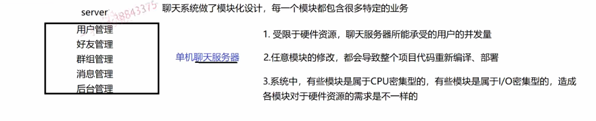


- 集群:

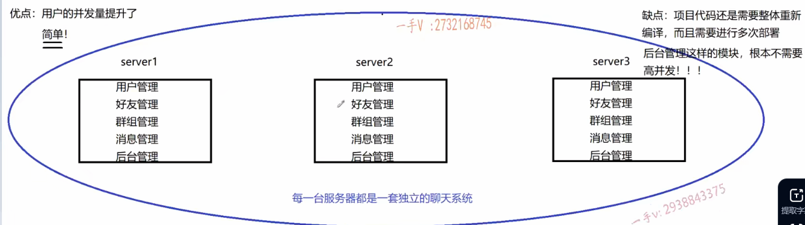


- 分布式

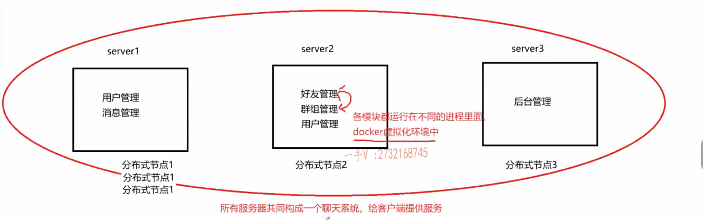


## RPC通信原理（远程过程调用）

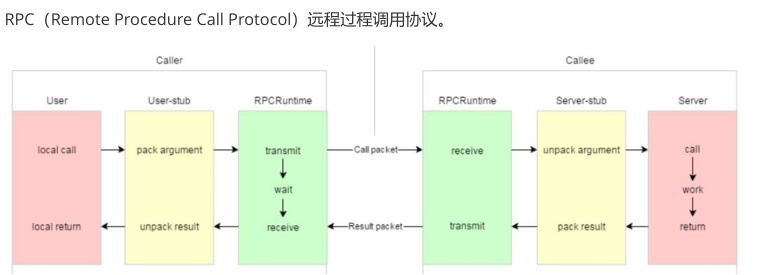

**黄色部分**：设计rpc方法参数的打包和解析，也就是数据的序列化和反序列化，使用==Protobuf==。 

- protobuf是二进制存储的；xml和json是文本存储
- JSON不需要存储额外的相关数据。JSON存储数据的方式是采用key-value键值对的形式。如："name":"张三"、"pwd":"123456"，“张三” “123456”

**绿色部分**：网络部分，包括寻找rpc服务主机，发起rpc调用请求和响应rpc调用结果，使用==muduo网络== 库和==zookeeper服务配置中心==（专门做服务发现）。 

mprpc框架主要包含以上两个部分的内容。


## prorobuf

```bash
protoc 

protoc test.proto --cpp_out=./  #  ./表示当前目录

g++ main.cc test.pb.cc -lprotobuf   # -lprotobuf 链接动态库
g++ *.cc -lprotobuf 
```


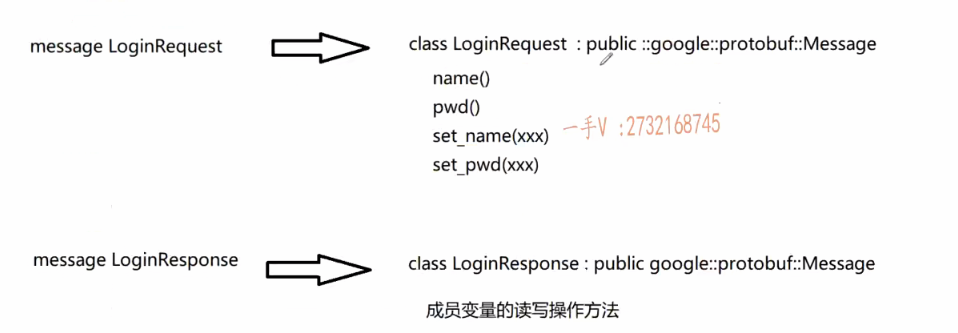

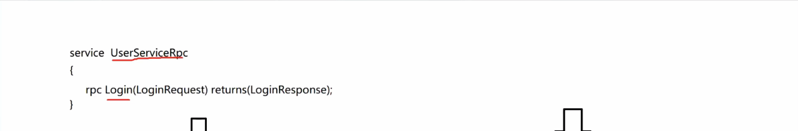

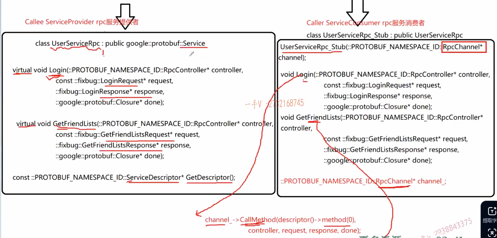

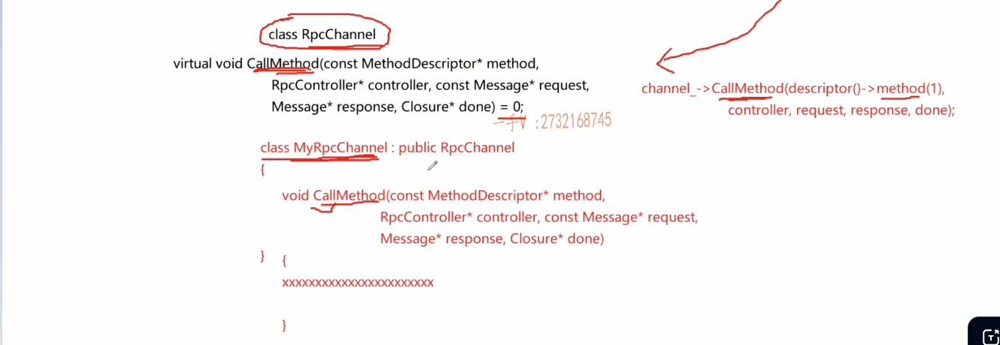


- NotifyService函数作用图

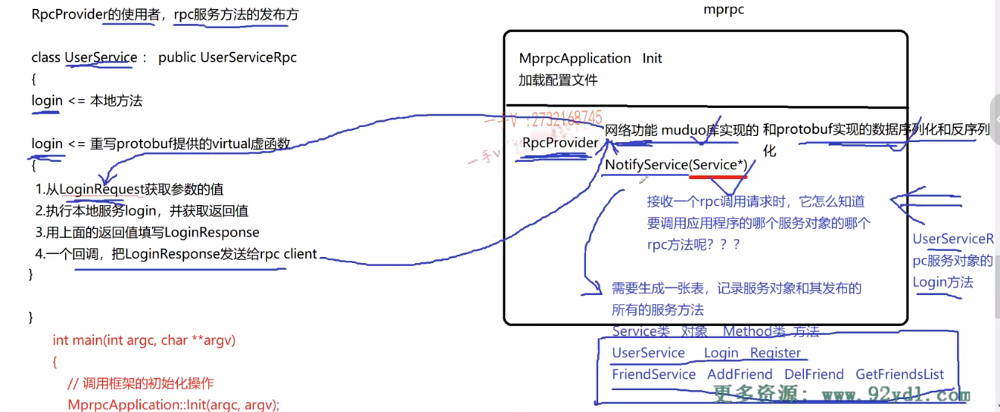


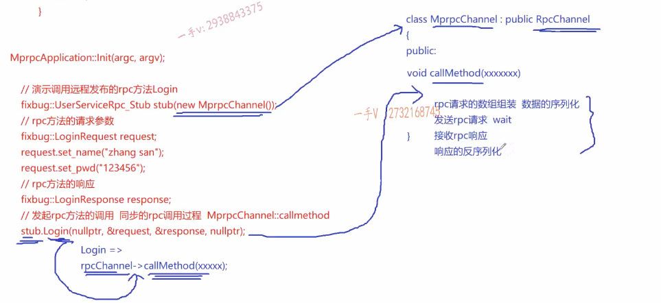


- 日志模块

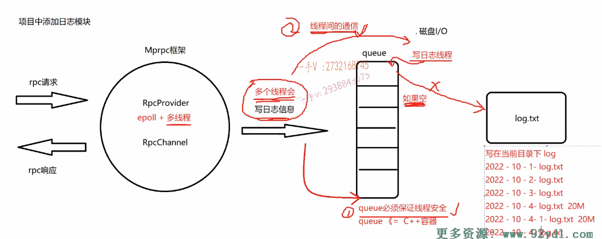


- zookeeper

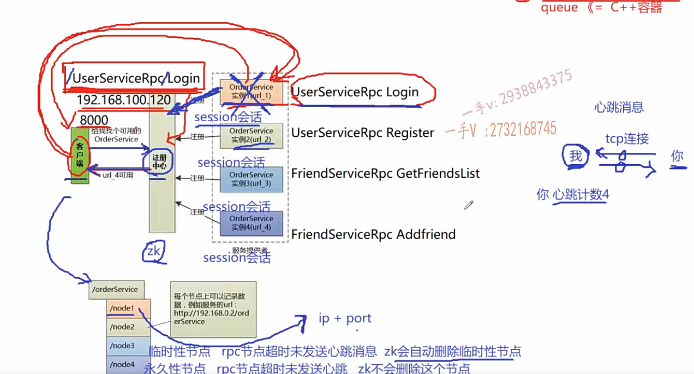


